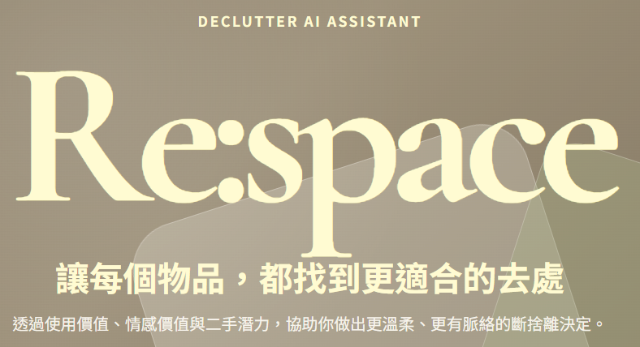

# Re:space - AI 斷捨離輔助決策系統

> **讓每個物品，都找到更適合的去處。**

Re:space 是一個基於 AI 與模糊邏輯 (Fuzzy Logic) 的斷捨離決策輔助系統。透過評估物品的「使用價值」、「情感連結」以及「二手市場潛力」，為使用者提供溫柔且理性的物品整理建議。

<p align="center">
  
</p>

---

## 🚀 核心功能

- **四步驟物品建檔**：直觀的 Wizard 介面，從類別、基本資料到使用感觸與情感描述。
- **多維度 AI 評估**：
    - **二手行情預測**：基於 Mercari 數據集的價格預估模型。
    - **情感價值分析**：分析使用者描述，量化與物品之間的情感紐帶。
    - **使用價值分類**：根據使用頻率與年限，判斷物品目前的實用程度。
- **模糊推論決策**：不只是給分數，透過模糊邏輯系統產出最終建議（保留、出售、捐贈、丟棄）。
- **個人化 AI 解釋**：整合 Google Gemini API，根據分析數據生成一段暖心且具說服力的分析報告。

---

## 🏗️ 系統架構

專案採用三層架構：

1.  **Frontend (Vanilla Web)**: 提供響應式使用者介面，引導使用者完成評估流程。
2.  **Backend (FastAPI Adapter)**: 擔任中介與翻譯角色，處理前端與 AI Server 的欄位轉換、Gemini 解釋生成與靜態檔案服務。
3.  **AI Server (Core Engine)**: 專門負責運行各項 AI 模型（價格預測、情緒分析、分類）以及模糊推論系統。

---

## 📂 專案結構

```text
11402_AIproject/
├── ai_server/          # AI 推論核心服務 
│   ├── secondhand/     # 二手價格預測模型相關
│   ├── sentiment/      # 情感分析模型相關
│   ├── usevalue/       # 使用價值分類模型相關
│   ├── app.py          # AI Server 入口點
│   └── fuzzy_inference.py # 模糊推論系統
├── backend/            # 後端轉接層 
│   ├── main.py         # 後端入口點（服務靜態檔案與 API）
│   ├── routers/        # API 路由邏輯
│   └── services/       # 翻譯層與評分邏輯
├── static/             # 前端靜態資源 (CSS, JS, Images)
├── templates/          # 前端 HTML 模板 (index.html)
└── docker-compose.yml  # Docker 容器編排設定
```

---

## 🐳 快速部署
**條件：** 安裝 [Docker Desktop](https://www.docker.com/products/docker-desktop/)

### 1. 準備必要檔案

請建立專案資料夾，並準備以下檔案：

#### A. `.env` 
在相同目錄建立 `.env`：
```bash
GROQ_API_KEY=您的_GROQ_API_KEY
```

#### B. 模型檔案 (Models)
確保您已將以下模型資料夾複製到與 `docker-compose.yml` 相同的相對路徑下：
- `ai_server/secondhand/mercari_ext/models_exported/`
- `ai_server/sentiment/models/`
- `ai_server/usevalue/models/`

### 2. 啟動服務

在該目錄下執行：
```bash
docker compose up 
```

### 3. 訪問系統
- **前端主介面**: `http://localhost:8080/`
